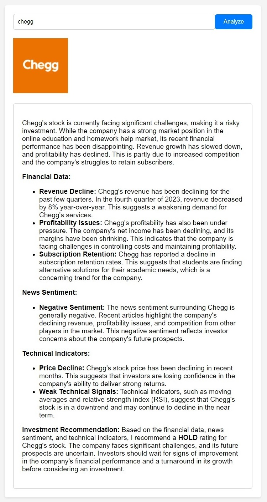

# StockAdvisor-CrewAI-Agent

## Agent Overview

StockAdvisor, a potent tool developed with the assistance of CrewAI, is customized for individuals eager to invest and profit in the stock market but lack the time or expertise for thorough research. It provides professional guidance at no cost, catering to busy lifestyles. Having personally benefited from this tool, I've achieved substantial financial gains in the stock market. Now, it's your turn to reap its rewards. I am open-sourcing this incredible personal agent.
<h1 align="center">


</h1>

## Technical Stack
- **Modular Directory Structure:** Organized codebase for easy maintenance and scalability
- **Google Gemini 1.5 Flash:** Utilized one of the best and most capable large language models by Google, boasting an extensive context length.
- **CrewAI:** Utilized a multi-agent framework where agents can communicate and collaborate with each other.
- **FastAPI:** Develop a robust and interactive web interface featuring a RESTful API.
- **Frontend:** Working

## CI/CD Pipelines
- **GitHub Actions:** Automated CI/CD pipelines for continuous integration and deployment
- Automated testing and validation of code changes
- Automated deployment to AWS Cloud infrastructure

## Cloud Deployment
- **AWS Cloud:** Deployed on Amazon Web Services (AWS) for scalability and reliability
- **EC2 Instance:** Running the chatbot application on a secure and scalable EC2 instance
- **ECR:** Using Amazon Elastic Container Registry (ECR) for container image management

## Instructions for Execution
### 1. Cloning the Repository
```bash

git clone https://github.com/MANMEET75/StockAdvisor-CrewAI-Agent.git
```
### 2. Creating the virtual environment using anaconda
```bash
conda create -p venv python=3.11 -y
```

### 3. Activate the virtual environment
```bash
conda activate venv/
```

### 4. Install the Requirements
```bash
pip install -r requirements.txt
```

### 5. Run the FastAPI application
```bash
uvicorn main:app --reload --port 8080
```
### React Application Installation Steps
1. **Install Node.js:** Make sure you have Node.js installed on your system.
2. **Create React App:** Run npx create-react-app my-app to create a new React project.
3. **Install Dependencies:** Navigate to your React project directory (my-app in this case) and install additional dependencies using npm install axios for making HTTP requests.
4. **Start Development Server:** Run npm start to start the development server.
5. **Update App.js:** Replace the API URL over here as we are calling an API here.

Enjoy Coding!
